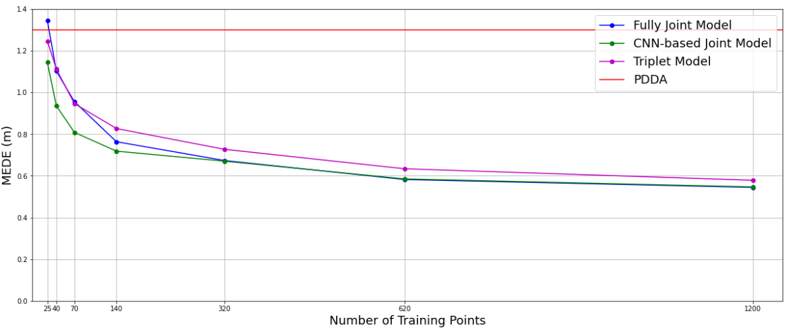
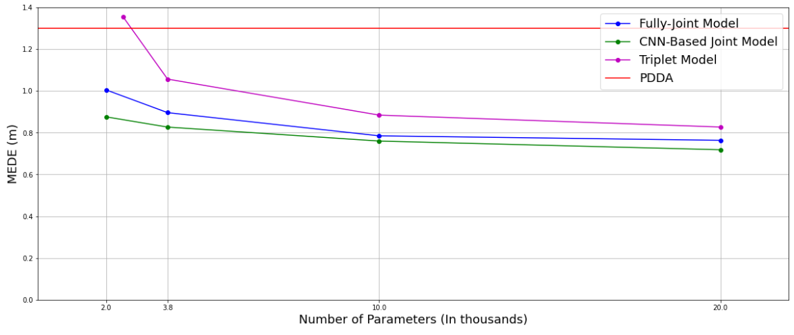

# Bluetooth Indoor Positioning with DNNs

As part of this project, 5 different machine learning approaches were designed and implemented to perform indoor positioning using bluetooth signals collected by 4 different anchor points. A tag transmitts a signal which, upon arrival to the anchor points, is fed to the ML models in order to estimate the angles of arrival to each anchor point. Finally, the estimated angles of arrival are fed to a positioning algorithm that utilizes the least squares method to produce a position estimate.

The dataset on which the ML models were trained and evaluated can be found at https://zenodo.org/record/6303184

## Overview

* functions folder contains files with definitions for the 5 machine learning model classes and various functions used for data processing, model evaluation and visualizations.

* training.ipynb is an example notebook for the machine learing models

* training_cnn.ipynb is an example notebook for the cnn model, since it requires some minor tweaks. 

## Dataset

The data used was generated via ray-tracing simulations in an environment of dimensions 14m x 7m. Multiple setups were examined with varying parameters that affect indoor positioning tasks. The different room setups are used are:

Room Setup                              | Description
-------------                           | -------------
testbench_01                            | No line-of-sight blocking furniture
testbench_01_furniture_low              | One line-of-sight blocking furniture
testbench_01_furniture_mid              | Three line-of-sight blocking furniture
testbench_01_furniture_high             | Six line-of-sight blocking furniture
testbench_01_furniture_low_concrete     | Same as low but with concrete furniture
testbench_01_furniture_mid_concrete     | Same as mid but with concrete furniture
testbench_01_furniture_high_concrete    | Same as high but with concrete furniture
testbench_01_rotated_anchors            | Same as testbench_01 but the anchors have been rotated clockwise by 5 degrees
testbench_01_translated_anchors         | Same as testbench_01 but the anchors have been translated by 10cm

More detailed information about the dataset can be found at https://zenodo.org/record/6303184.

## Functions

### Data Processing

data_processing.py contains functions that are used during the processing phase of the data

### Models

models.py contains classes that implement the 5 different model architectures:
* independentArch: Each anchor estimates its AoA independently
* jointArch: The predictions are computed by jointly exploiting all anchor inputs
* tripletsArch: The predictions are computed by jointly exploiting all possible triplet of anchors inputs
* pairsArch: The predictions are computed by jointly exploiting all possible pair of anchors inputs
* cnnArch: The predictions are computed from an image that contains all the anchor data and uses the BLE channels as image channels.

### Prediction

predictions.py contains functions that are use for making the position and AoA estimations.

### Visualization

visualization.py contains functions that are used for visualizing the results.

## General Comments

### Training Set Size

Only 140 tag locations were used for training, each being more than 1m apart from each other. This sparse point selection strategy was chosen taking into account the difficulty of measurement collection in real life scenarios. However, we examined the effect training set size has on performance.

### Model Complexity

All models were tuned to have approximately 20k parameters so that the conducted experiments and comparisons were done on common grounds. Lower complexities were examined to  determine the effect they had on performance.

